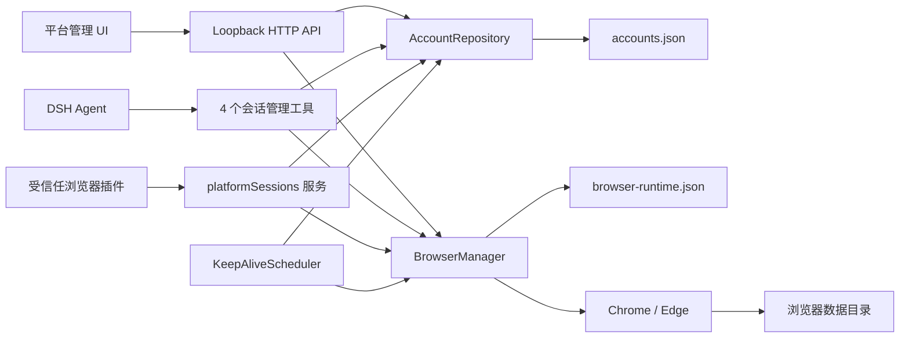

# DSH 平台账号管理器

一个面向 DeepSeek Harness（DSH）的本地优先平台账号与浏览器会话管理插件。

它把“平台账号”与“浏览器数据目录”作为两个独立概念管理：账号保存平台名称、后台地址和业务上下文；浏览器数据目录保存 Chromium 的 Cookie、Local Storage、IndexedDB 等登录状态。多个平台账号既可以使用相互隔离的目录，也可以按需共享同一个目录。

> 当前版本：`0.3.0`

## 为什么需要这个项目

Agent 要进入电商后台、内容平台、客服系统、广告平台或企业 SaaS 时，常见方案有几个现实问题：

1. **浏览器关闭后登录态丢失**：临时浏览器上下文或临时 Profile 结束后，下次打开又回到登录页。
2. **多账号容易串号**：多个平台账号共用默认浏览器环境，Cookie、Local Storage 和当前页面互相影响。
3. **账号与磁盘目录没有清晰映射**：不知道某个账号实际使用哪个浏览器配置，迁移、备份和清理都很困难。
4. **浏览器数据堆积在系统盘**：缺少自定义数据目录能力，长期使用后 C 盘持续增长。
5. **无法快速了解登录是否有效**：只有真正进入后台时才发现会话已经失效。
6. **长期不访问导致会话自然失效**：账号虽已登录，但平台长时间没有访问，Cookie 或服务端会话可能过期。
7. **账号管理和页面自动化职责混杂**：一个插件同时保存会话、点击页面、输入文本，会放大权限和维护范围。

本项目专注解决账号、浏览器数据目录和登录会话生命周期问题，不承担通用网页自动化。

## 核心特点

### 平台账号管理

- 新增、编辑、归档、恢复和永久移除账号记录。
- 平台名称自由输入，可兼容电商、内容、广告、客服和企业系统。
- 内置常见平台建议，但不把平台限制在固定枚举中。
- 后台地址和登录地址由用户配置，至少填写一个。
- 活动账号由“平台名称 + 账号名称”唯一识别，创建、编辑和恢复时都会拒绝重复组合；归档账号允许保留历史重名记录。
- “Agent 操作说明”用于提供账号用途、业务范围和注意事项等上下文，不是权限控制规则。

### 浏览器数据目录管理

- 每个目录固定使用 Chromium 的 `Default` 用户，不再引入额外的浏览器用户/Profile 层级。
- 新建账号时可以：
  - 在全局默认根目录下自动创建独立数据目录；
  - 通过系统原生目录选择器指定绝对路径；
  - 复用插件中已有的浏览器数据目录。
- UI 展示完整目录地址，并提供复制和打开文件夹操作。
- 支持 Google Chrome 与 Microsoft Edge。
- 自定义新目录必须为空，避免覆盖已有浏览器资料。
- 已登记的目录不允许重复或互相嵌套，降低误用风险。
- 账号创建后不支持换绑或移动到其他目录，避免跨目录复制登录资料带来的损坏与串号风险。
- 目录可以重命名，重命名只改变 UI 显示名称，不改变磁盘地址。

### 浏览器数据目录生命周期

目录与账号分别归档：

1. 先归档目录中的所有活动账号；
2. 确认该目录对应的浏览器已经关闭；
3. 再归档目录；
4. 归档目录可以恢复，也可以进入删除流程。

UI 会分别显示活动账号引用数和归档账号引用数。删除归档目录时，所有仍引用它的归档账号记录会在同一次确认操作中永久移除，避免留下失效引用。

删除提供两种模式：

- **仅移除目录登记，保留本机文件**：适用于所有目录来源；
- **移除登记并删除本机浏览器数据**：只适用于插件在默认 `browserDataRoot/<directory-id>` 下创建的目录。

物理删除必须同时满足：目录已归档、浏览器离线、没有活动账号引用、路径严格位于默认根目录、目录不是符号链接或联接、所有权标记与目录记录完全匹配，并由用户输入完整目录名称确认。旧版 `profiles/` 目录和用户自定义目录永远只能取消登记，插件不会递归删除其本机文件。

### 共享与隔离可以按业务选择

**独立目录**适合：

- 同一平台的多个账号；
- 必须严格隔离 Cookie 和站点存储的账号；
- 风控敏感或权限边界不同的业务。

**共享目录**适合：

- 同一组织下彼此信任的多个不同平台；
- 希望共用一个浏览器进程，减少内存与进程数量；
- 需要在同一浏览器环境中保留关联站点状态。

共享目录意味着共享全部浏览器状态，不只是某一个平台的 Cookie。关闭这个目录对应的浏览器时，该目录下所有账号页面都会一起关闭。

## Cookie 持久化机制

Chromium 原本会把普通持久 Cookie 保存到浏览器数据目录，但部分登录状态使用“会话 Cookie”，默认可能随着浏览器会话结束而清除。

插件在托管浏览器在线时执行以下流程：

1. 通过本机 CDP 读取当前浏览器上下文中的 Cookie。
2. 只选取会话 Cookie，并跳过无法安全复制的不透明分区 Cookie。
3. 使用 `Storage.setCookies` 为可处理的会话 Cookie 设置本地到期时间。
4. 由 Chromium 自己把更新后的 Cookie 写回原浏览器数据目录。
5. 下次启动时继续使用同一个数据目录，由 Chromium 恢复 Cookie 和其他站点存储。

浏览器启动后的前 60 秒每 2 秒同步一次，之后每 15 秒同步一次；人工标记已登录、关闭浏览器和登录检测也会触发同步。

### 这项机制的边界

- 它只能改变本机 Cookie 的持久化属性和到期时间。
- 它不能延长服务端 token、session、refresh token 或设备授权的有效期。
- 它不能阻止平台主动注销、异地登录失效、密码变更失效或风控校验。
- 它不能绕过验证码、扫码、设备验证或多因素认证。
- 平台仍可根据服务端策略随时要求重新登录。
- Cookie 和浏览器数据目录属于敏感认证资料，应像密码一样保护，不应上传到代码仓库或共享网盘。

## 固定 CDP 端口与登录风控

开发期间对 Chrome 和 Edge 做了控制变量测试：

| 启动方式 | 实测结果 |
| --- | --- |
| 不启用远程调试 | 账号密码登录成功 |
| `--remote-debugging-port=0` | 登录验证持续失败 |
| 固定的非零远程调试端口 | 登录成功 |

在本次环境中，`port=0` 会使 Chromium 暴露 `AutomationControlled` 特征，而固定非零端口没有触发同样结果。因此插件采用：

```text
--remote-debugging-address=127.0.0.1
--remote-debugging-port=<运行时分配的固定非零端口>
--user-data-dir=<浏览器数据目录>
```

同时遵循以下限制：

- 调试服务只监听 `127.0.0.1`。
- 不添加 `--enable-automation`。
- 不使用 `--remote-debugging-port=0`。
- 不向 UI 或 Agent 工具返回调试端口。
- 端口只保存在本地运行时登记文件中。

这是针对当前 Chrome、Edge 与目标平台的实测结论，不代表所有平台风控都采用相同判断。启用 CDP 仍可能被某些站点识别。

固定端口启动时 Chromium 不会提供可依赖的 `DevToolsActivePort` 文件，因此插件维护独立的 `browser-runtime.json`，记录“数据目录 -> PID、端口、实例 ID”的对应关系。DSH 重启后会验证 PID 和 CDP 健康状态，只恢复仍然有效的记录，并清理陈旧记录。

## 登录状态检测

每个账号都可以随时执行“检测登录状态”。检测流程严格限制为：

1. 打开该账号配置的后台地址；
2. 等待页面跳转稳定；
3. 根据最终 URL、后台域名和登录地址判断是否发生登录重定向；
4. 同步 Cookie；
5. 关闭检测用临时标签页；
6. 如果检测前浏览器未运行，则检测后关闭本次临时启动的浏览器。

登录检测不会读取页面正文、生成 DOM 快照、点击控件、输入账号密码或处理验证码。

检测结果包括：

- `valid`：受保护后台地址成功打开，未落到登录地址；
- `invalid`：最终地址是配置的登录地址或明显的登录路径；
- `unknown`：通用 URL 规则无法证明是否已登录；
- `error`：浏览器启动、页面加载或 CDP 通信失败；
- `unchecked`：尚未检测。

对于登录页和后台页使用完全相同 URL、单页应用内部切换状态或不发生 URL 跳转的平台，检测可能返回 `unknown`。

账号行只保留一个“检测登录状态”入口。检测完成后显示结果弹窗：`valid` 自动标记有效，`invalid` 自动标记失效，只有 `unknown` 或 `error` 才显示“人工标记为已登录”。人工确认会清除旧的自动失败展示，并记录来源和时间；它只表示用户完成了人工核验，不代表插件从平台服务端取得了有效性证明。

## 定时会话保活

内置定时保活默认关闭。

账号可以独立设置：

- 是否启用；
- 运行间隔，范围 `1` 到 `720` 小时；
- 随机延迟，范围 `0` 到 `240` 分钟；
- 允许运行的每日时间窗口；
- 本次任务临时启动浏览器后是否自动关闭；
- 立即运行一次。

调度器每分钟检查到期任务。共享同一个浏览器数据目录的到期账号会被分为一组，在同一个浏览器进程中依次检测，减少重复启动成本。

每次运行会访问账号配置的后台地址、观察登录重定向并同步 Cookie。失败任务使用指数退避，最大放大到正常间隔的 8 倍。

定时访问可以让平台有机会刷新 Cookie 或服务端会话，但是否刷新、刷新多久完全取决于平台。插件不会伪造业务操作，也不保证会话一定被延长。

当前版本只在账号管理器内部串行化同一目录的启动、检测、Cookie 同步和关闭操作，没有实现跨插件的“前台任务租约”。如果另一个插件正在操作同一浏览器，内置保活仍可能打开或关闭临时标签页而影响任务。计划由 Agent 定时任务负责保活时，建议保持内置保活关闭，让 Agent 在没有业务任务时调用 `platform_account_check_login`；不要同时启用两套调度。

## Agent 工具

插件只向 Agent 注册四个会话管理工具：

| 工具 | 作用 |
| --- | --- |
| `platform_account_list` | 按平台名称和账号名称列出账号、登录检测、保活和浏览器状态 |
| `platform_account_open` | 在托管浏览器中打开配置的后台或登录地址 |
| `platform_account_check_login` | 使用临时标签页检测登录状态 |
| `platform_browser_close` | 同步 Cookie 后关闭整个浏览器数据目录对应的浏览器 |

`platform_browser_close` 会经过 DSH 工具批准流程，因为共享目录下可能有多个账号受到影响。

工具输出不包含：

- 浏览器数据目录路径；
- CDP 端口和 WebSocket 地址；
- Cookie 值；
- 密码或验证码。
- 账号标识、后台地址和登录地址。

Agent 先使用 `platformName + name` 识别目标账号，再把返回的 `id` 传给其他工具。目录名称、目录 ID 和目录地址都不参与 Agent 的账号识别。

## 明确不做什么

这个插件不提供通用页面自动化，因此没有以下能力：

- 页面 DOM 快照；
- 文本抓取和元素引用；
- 任意 URL 导航；
- 点击、输入、按键；
- iframe 或弹窗控制；
- 验证码识别；
- 绕过平台风控。

需要操作页面的插件应作为独立插件开发，通过内部会话服务连接已打开的受信任浏览器，而不是把页面操作重新塞回账号管理器。

## 内部会话服务

插件在 Cordis 上提供 `ctx.platformSessions`，供本机受信任插件使用：

```ts
interface PlatformSessionService {
  list(): Promise<PlatformAccount[]>
  open(accountId: string): Promise<PlatformStatus>
  close(accountId: string): Promise<void>
  checkLogin(accountId: string): Promise<LoginCheckResult>
  connection(accountId: string): Promise<TrustedBrowserConnection>
}
```

`connection()` 返回环回地址上的内部 CDP endpoint。它不会通过本地 HTTP API 或 Agent 工具公开。未来的浏览器操作插件应注入 `platformSessions` 服务，并继续自行定义操作范围、批准规则和审计策略。

## 架构



### 模块职责

| 文件 | 职责 |
| --- | --- |
| `src/index.ts` | 插件配置、依赖注入和生命周期装配 |
| `src/shared.ts` | 账号、目录、状态和保活共享类型 |
| `src/store.ts` | v3 数据模型、迁移、目录生命周期、安全删除、校验和原子写入 |
| `src/browser.ts` | 浏览器启动、运行时登记、Cookie 同步和登录检测 |
| `src/maintenance.ts` | 定时保活、共享目录分组和失败退避 |
| `src/api.ts` | 仅限本机 UI 的 HTTP API 与目录选择器 |
| `src/tools.ts` | Agent 可见的最小工具集 |
| `src/service.ts` | 供受信任插件使用的内部会话服务 |
| `src/client/` | DSH 设置页中的“平台管理”界面 |

本项目遵循 DSH 的 Cordis 插件模型：通过 `inject` 声明依赖，通过 `ctx.effect()`、`ctx.interval()` 和 Service 生命周期注册可撤销资源。参考 [DeepSeek Harness 插件开发文档](https://github.com/deepseek-ai/deepseek-harness/blob/master/docs/user/develop/basic/index.md) 与 [DSH 架构说明](https://github.com/deepseek-ai/deepseek-harness/blob/master/docs/architecture.md)。

## 数据模型与本地文件

默认数据目录：

```text
%DSH_HOME%/store-account-manager/
```

未设置 `DSH_HOME` 时，通常为：

```text
~/.dsh/store-account-manager/
```

目录内容：

```text
store-account-manager/
├── accounts.json                # v3 元数据，不保存密码和 Cookie 值
├── accounts.v1.backup.json      # 首次从 v1 迁移时创建
├── accounts.v2.backup.json      # 首次从 v2 迁移时创建，内容与原文件完全一致
├── browser-runtime.json         # 当前浏览器 PID 与环回 CDP 端口
├── profiles/                    # v1 账号原有目录，迁移后仍原地使用
└── browser-data/                # 默认新建目录根路径
    └── <directory-id>/
        ├── .dsh-browser-data.json
        └── Default/             # Chromium 自己维护的数据
```

账号元数据与浏览器状态分离：

- 一个 `PlatformAccount` 必须指向一个 `BrowserDataDirectory`；
- 多个账号可以指向同一个目录；
- 目录记录包含浏览器类型、绝对路径和 `plugin-created`、`custom` 或 `legacy` 来源；
- Cookie 不会复制到 `accounts.json`；
- 所有 JSON 更新使用临时文件加原子重命名写入。

## 安全与隐私边界

- HTTP API 只接受环回连接。
- 带 `Origin` 的请求只接受 `localhost`、`127.0.0.1` 或 `::1`。
- API 响应禁用缓存，并设置 `X-Content-Type-Options: nosniff`。
- 浏览器路径只返回给本机设置 UI，不进入 Agent 工具结果。
- CDP 只绑定环回地址，端口不会向 Agent 暴露。
- 插件不收集、不提交、不上传任何账号或浏览器数据。
- 插件不会读取或保存账号密码。
- 账号记录删除与目录删除分离，目录物理删除需要多重所有权校验和显式确认。

环回 CDP 仍然是一项高权限本机能力。同一操作系统用户下的恶意进程可能尝试探测本机端口，因此应确保电脑账户、插件来源和本地进程可信。

## 安装

### 环境要求

- Node.js `>= 22.19`
- pnpm
- DSH Web Profile
- Google Chrome 或 Microsoft Edge

### 本地开发安装

```powershell
git clone https://github.com/sycamorestr/dsh-store-account-manager.git
cd dsh-store-account-manager
pnpm install
pnpm build
dsh plugin --profile web add link:$PWD
dsh web --no-open
```

然后打开：

```text
http://127.0.0.1:3080/
```

进入 DSH 设置，选择“平台管理”。

链接安装后，源码更新需要重新执行 `pnpm build` 并重启 DSH。DSH Profile 通过 bundle 的 `cordis.patch.yml` 挂载插件；官方说明见 [Profiles 与 bundles](https://github.com/deepseek-ai/deepseek-harness/blob/master/docs/architecture.md#profiles-and-bundles)。

## 配置

| 配置项 | 默认值 | 说明 |
| --- | --- | --- |
| `dataDir` | `~/.dsh/store-account-manager` | 元数据、运行时登记和 v1 旧目录根路径 |
| `browserDataRoot` | `<dataDir>/browser-data` | 自动创建浏览器数据目录的默认根路径 |
| `cookieRetentionDays` | `365` | 会话 Cookie 转为持久 Cookie 时使用的本地期限，范围 1-3650 天 |
| `chromePath` | 自动检测 | Chrome 可执行文件绝对路径 |
| `edgePath` | 自动检测 | Edge 可执行文件绝对路径 |

可以在 Web Profile 的 `cordis.patch.yml` 中覆盖完整配置：

```yaml
- id: store-account-manager
  config:
    dataDir: 'D:\DSH\platform-manager'
    browserDataRoot: 'E:\BrowserData'
    cookieRetentionDays: 365
    chromePath: 'C:\Program Files\Google\Chrome\Application\chrome.exe'
    edgePath: 'C:\Program Files (x86)\Microsoft\Edge\Application\msedge.exe'
```

DSH 的配置 patch 会整体替换目标行的 `config`，修改时应保留需要的全部字段。

## 数据迁移

### v1 到 v3

如果检测到 `accounts.json` 的版本是 `1`：

1. 原文件原样备份为 `accounts.v1.backup.json`；
2. 每个旧账号创建一个同 ID 的浏览器数据目录记录；
3. 目录地址继续指向原来的 `profiles/<account-id>`；
4. 不移动、复制、扫描或导出原有 Cookie；
5. 将旧目录标记为 `legacy`，不授予插件物理删除权限；
6. 原子写入 v3 `accounts.json`。

迁移不会把旧浏览器资料搬到新的 `browser-data/`。旧登录状态能否继续使用，仍由原目录内容和平台服务端有效期决定。

### v2 到 v3

首次由 `0.2.x` 升级到 `0.3.0` 时：

1. 原文件逐字节备份为 `accounts.v2.backup.json`；
2. `profiles/<account-id>` 推断为 `legacy`；
3. 精确位于 `browserDataRoot/<directory-id>` 的目录推断为 `plugin-created`；
4. 其余地址推断为 `custom`；
5. 已有自动检测结论标记为 `automatic`，没有自动有效结论的 `ready` 状态标记为 `manual`；
6. 只更新元数据，不移动、复制、扫描或导出任何浏览器目录与 Cookie。

## 常用操作

### 新建独立账号

1. 打开“平台管理”。
2. 选择“新增账号”。
3. 填写平台名称、账号名称和后台/登录地址。
4. 选择“新建数据目录”。
5. 选择 Chrome 或 Edge，可选自定义空目录。
6. 创建后点击“打开平台”，在浏览器中手动登录。
7. 回到 DSH 点击“检测登录状态”；通用规则无法判断时，可在结果弹窗中人工标记。

### 让多个平台共享一个目录

1. 新增第二个账号。
2. 选择“复用已有目录”。
3. 选择目标目录并创建。

共享后，这些账号使用同一个浏览器进程和全部站点数据。不要用它承载需要互相隔离的同平台账号。

### 把数据放到非系统盘

有两种方式：

- 修改全局 `browserDataRoot`，让后续自动创建目录都进入指定磁盘；
- 新增账号时选择一个自定义空目录，只覆盖当前新目录。

## 故障排查

### 浏览器打开后仍是登录页

- 点击“检测登录状态”查看最终判断。
- 确认打开的是同一个浏览器数据目录。
- 确认没有手动用普通 Chrome/Edge 同时占用该目录。
- 平台服务端 token 可能已经失效，需要重新登录。
- 登录流程可能要求扫码、验证码或设备验证，插件不会代为处理。

### 账号密码登录时验证码始终失败

- 确认浏览器启动参数不是 `--remote-debugging-port=0`。
- 当前插件只使用固定非零端口，不添加 `--enable-automation`。
- 即使如此，平台仍可能根据设备、网络、行为或 CDP 特征触发风控。
- 可在平台允许的情况下使用扫码等官方登录方式。

### 提示数据目录已被占用

Chromium 不允许多个浏览器进程同时安全写入同一个用户数据目录。关闭手动打开的同目录浏览器，再由插件重新打开。

### 自定义目录无法创建

- 必须是绝对路径；
- 不能是磁盘根目录或系统程序目录；
- 不能是网络 UNC 路径；
- 新目录必须为空；
- 不能与已登记目录相同、互为父目录或子目录。

### 登录检测返回 `unknown`

检查后台地址与登录地址是否准确。部分单页应用不通过 URL 表达登录状态，通用检测无法可靠判断；这类平台可在结果弹窗中人工确认，并把更精确的适配规则放在未来的平台专用插件中。

### DSH 重启后显示浏览器离线

`browser-runtime.json` 只恢复 PID 和 CDP 端点都仍健康的浏览器。如果浏览器已经退出、PID 变化或端口不可访问，旧记录会被清除；再次点击“打开平台”即可重新建立运行时。

## 开发与验证

```powershell
pnpm typecheck
pnpm test
pnpm build
```

当前测试覆盖：

- v1 到 v3 与 v2 到 v3 原地迁移、完整备份、来源推断和旧目录保留；
- 自由平台名称和 HTTP(S) URL 校验；
- 自定义绝对路径、空目录、重复/嵌套目录拒绝；
- 新目录创建与已有目录复用；
- 账号更新、归档、恢复和移除；
- 活动账号“平台名称 + 账号名称”唯一性；
- 目录重命名、归档、恢复、归档账号级联与受保护物理删除；
- 自动检测与人工确认来源切换；
- 归档目录和归档账号的 API 装饰；
- 保活时间窗口与确定性调度；
- 固定非零 CDP 端口和启动参数；
- 会话 Cookie 持久化参数转换；
- 陈旧运行时登记清理；
- Agent 工具面收敛；
- 登录检测不进行 DOM 或正文提取。

构建输出：

- `lib/index.js`：Node 端插件；
- `lib/index.js.map`：服务端 source map；
- `lib/client.js`：DSH Web 客户端模块。

## 设计原则

1. **本地优先**：账号元数据和浏览器资料都留在用户指定的本机目录。
2. **目录是真正的身份边界**：是否共享 Cookie 由浏览器数据目录决定，不制造额外的“浏览器空间”概念。
3. **最小 Agent 能力**：账号管理器只暴露会话管理工具，不暴露通用网页控制。
4. **可恢复运行时**：固定端口通过独立登记文件恢复，不依赖 `DevToolsActivePort`。
5. **迁移不搬数据**：旧浏览器目录原地沿用，降低登录态和大体积文件迁移风险。
6. **失败显式可见**：登录检测、Cookie 同步和保活结果都进入 UI 状态。
7. **不夸大持久化能力**：本地 Cookie 期限与平台服务端有效期是两件事。
8. **危险删除必须证明所有权**：自定义和旧版目录默认不受插件物理删除能力控制。

## License

MIT
